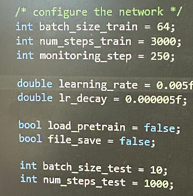
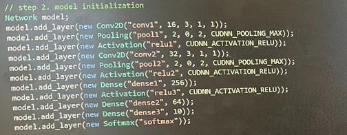
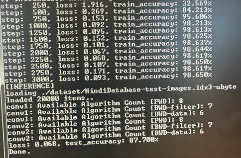
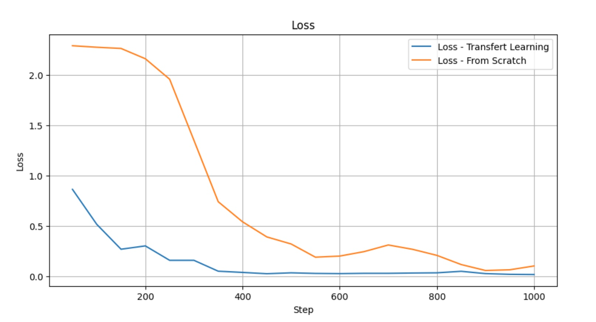
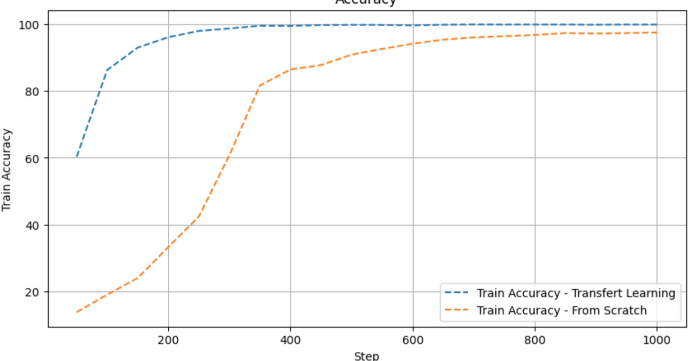

# TP3&4 : Application Embarquée & Cross Compilation - BOCHU BRAVAR

## Questions

### Base de données

> - **Hindi :**
>   - Train :
>     - **Nombre d'exemples dans la base de données d'entraînement** : 17,000 images.
>     - **Taille des images** : Chaque image a une taille de 32x32 pixels, identique à l'ensemble de test.
>     - **Nombre de labels/classes** : Il y a 17,000 labels, ce qui signifie que chaque image de l'ensemble d'entraînement a également un label correspondant.
>   - Test :
>     - **Nombre d'exemples dans la base de données de test** : 20,000 images.
>     - **Taille des images** : Chaque image a une taille de 32x32 pixels.
>     - **Nombre de labels/classes** : Il y a également 20,000 labels, ce qui indique que chaque image dans l'ensemble de test a un label correspondant.

### Entrainement from scratch
>   - **Résultats de l'apprentissage** :
>    - La précision de l'entraînement (train_accuracy) a commencé à 32.56% après 250 étapes et a augmenté de manière significative pour atteindre 98.65% après 3000 étapes.
>    - La perte (loss) a commencé à 1.916 après 250 étapes et a diminué pour atteindre 0.093 après 3000 étapes.
>    - Sur les données de test, la précision obtenue est de 87.70%.
>    - 

### Analyse
>  - **Différence de précision** : Oui, il y a une différence entre la précision sur les données d'entraînement (98.65%) et les données de test (87.70%).
>  - **Interprétation de la différence** : Cette différence peut indiquer un surapprentissage (overfitting), où le modèle est très précis sur les données d'entraînement, mais moins généralisable aux données nouvelles ou non vues, représentées par l'ensemble de test.
>  - **Déductions** : S'il y a des confusions entre certaines classes, cela pourrait indiquer des similitudes dans les caractéristiques visuelles des caractères ou que le modèle a besoin de plus de données ou d'un entraînement supplémentaire pour distinguer ces classes.

### Transfert 

> - Pour le transfert learning, on remarque que la précision d'entraînement commence à un niveau relativement élevé et augmente rapidement pour atteindre une précision très élevée. La perte commence à un niveau faible et diminue progressivement. Cela suggère que le modèle a bénéficié de connaissances préalables (grâce au modèle pré-entrainé) qui lui ont permis d'apprendre rapidement et efficacement la tâche spécifique.
> - Pour la partie from scratch, la précision commence à un niveau beaucoup plus bas et la perte est beaucoup plus élevée. Néanmoins, au fil des étapes, la précision s'améliore de façon significative et la perte diminue, ce qui montre que le modèle apprend progressivement à partir de zéro.
> - La différence entre ces deux courbes suggère que le transfert learning permet une convergence plus rapide et une meilleure précision initiale, probablement parce que le modèle transféré possède déjà des représentations de données utiles qui ne nécessitent que de petits ajustements pour la nouvelle tâche. Sans transfert learning, le modèle doit apprendre ces représentations à partir de zéro, ce qui nécessite plus de temps et d'étapes d'entraînement pour atteindre une précision similaire.

