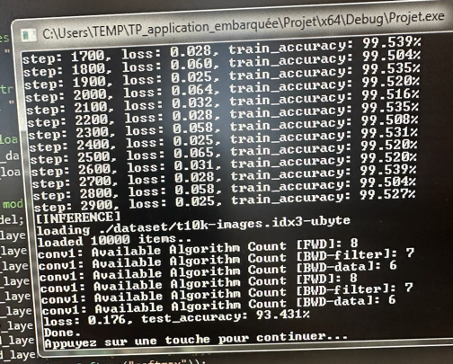

# TP1&2 : Application Embarquée & Cross Compilation - BOCHU BRAVAR

## Questions

### Base de données

>- **MNIST :**
>    - **Contenu :** La base de données MNIST contient des images de chiffres écrits à la main, de 0 à 9.
>    - **Nombre d'exemples :** Elle est divisée en deux parties : 60 000 images pour l'entraînement et 10 000 images pour les tests.
>    - **Taille des images :** Chaque image est de taille 28x28 pixels, en niveaux de gris.
>    - **Labels/classes :** Les labels correspondent aux chiffres que chaque image représente, allant de 0 à 9.

### Choix du CNN

>- **Paramètre utilisé :**
>    - `n` représente la taille du batch, 256
>    - `c` le nombre de canaux (channels), 1 car c'est des composantes de gris
>    - `h` la hauteur, 28 px
>    - `w` la largeur. 28 px

- ### **Architecture :**
 > - **Première partie**: consiste à une succession de bloc résiduels (conv->relu->pooling) pour extraires les différentes features de nos images
 >     - Convolution1 : 24 filtres en sortie, kernel_size = 3
 >     - Activation1 : ReLU max(0, x)
 >     - MaxPooling1 : Kernel_size = 2, padding = 0, Step = 2
 >     - Convolution2 : 24 filtres en sortie, kernel_size = 3
 >     - Activation2 : ReLU max(0, x)
 >     - MaxPooling2 : Kernel_size = 2, padding = 0, Step = 2 
 > - **Deuxième partie** : Réussir à trouver des patterns/tendances parmis les features: Full Connected 
 >   - Linear1 : output_size = 128
 >   - ReLU3 : ReLU max(0, x)
 >   - Linear2: output_size = 10, car nous avons 10 classes à prédire
 >   - Softmax: Permet de convertir les outputs de notre dernier layer en une probabilité, la somme de tous les neurones de cette couche = 1
 > - **Justification** :
 >   - Nous avons décider d'utiliser un modèle plutôt simple qui permette d'extraire les features de manière efficace sans non plus overfitter et sans utiliser trop de temps de calcul pour pouvoir tourner assez rapidement sur les pc de la salle informatique.

### Question CuDNN et mise en place du CNN
> - **CuDNN :** CUDA Deep Neural Network library (CuDNN) est une bibliothèque GPU-accelérée pour le deep learning. Elle fournit des implémentations hautement optimisées des routines standard pour la construction de CNNs.

> - **Fonctions CuDNN :**
>    - **`cudnnActivationForward` :** Cette fonction permet d'appliquer une fonction d'activation à l'ensemble du tensor en entrée. Les paramètres importants à comprendre sont :
>        - Le descripteur de la couche d'activation,
>        - Le tensor en entrée et en sortie,
>        - Le type d'activation à appliquer (ReLU, Sigmoid, Tanh, etc.).
>    - **`cudnnActivationBackward` :** Cette fonction calcule le gradient de la fonction d'activation par rapport à l'entrée, ce qui est essentiel pour la rétropropagation. Les paramètres clés incluent :
>        - Le descripteur de la couche d'activation,
>        - Les tensors en entrée et en sortie de la fonction d'activation,
>        - Le gradient par rapport à la sortie de l'activation,
>        - Le gradient par rapport à l'entrée de l'activation.

> Comme on peut le voir sur l'image de nos résultats, lorsque nous arrivons au bout de nos 2900 époques. La loss d'entrainement converge vers 0 (0.025) et notre accuracy vers 100 (99.527%). Cela veut juste dire que notre modèle peut totalement prédire les features de notre jeu de données. Mais pour être sur qu'il fonctionne réelement on l'expose à des données de test qu'il n'as jamais vu. Et ici nous obtenons 93.431% ce qui est plutôt concluent.

> Pour obtenir ces résultats nous avions déjà joué sur la batch_size, le nombre d'epochs ainsi que la learning rate.

### Analyse
> - Il y a forcément une différence entre la précision train et test car dans le test il y aura des images qui seront trop différente des images train, si l'écart est trop grand alors overfit

### **Matrice de Confusion**
|  Classe réelle \ Prédiction |0 | 1 | 2 | 3 | 4 | 5 | 6 | 7 | 8 | 9 |
|--------|-------|-------|-------|-------|-------|-------|-------|-------|-------|-------|
| 0 |980 | 0 | 3 | 0 | 0 | 2 | 0 | 0 | 0 | 0 |
| 1 |0 | 1135 | 0 | 0 | 2 | 0 | 0 | 5 | 0 | 0 |
| 2 |0 | 0 | 1032 | 4 | 0 | 0 | 0 | 0 | 3 | 0 |
| 3 |0 | 0 | 2 | 1010 | 0 | 0 | 0 | 0 | 3 | 0 |
| 4 |0 | 3 | 0 | 0 | 982 | 0 | 0 | 0 | 2 | 0 |
| 5 |2 | 0 | 0 | 0 | 0 | 892 | 3 | 0 | 0 | 0 |
| 6 |0 | 0 | 0 | 0 | 0 | 2 | 958 | 0 | 0 | 0 |
| 7 |0 | 5 | 0 | 0 | 0 | 0 | 0 | 1028 | 0 | 0 |
| 8 |0 | 0 | 2 | 3 | 2 | 0 | 0 | 0 | 974 | 0 |
| 9 |0 | 0 | 0 | 0 | 0 | 0 | 0 | 0 | 0 | 1009 |

> Nous n'avons pas réussi à extraire les données des targets/output.
 

